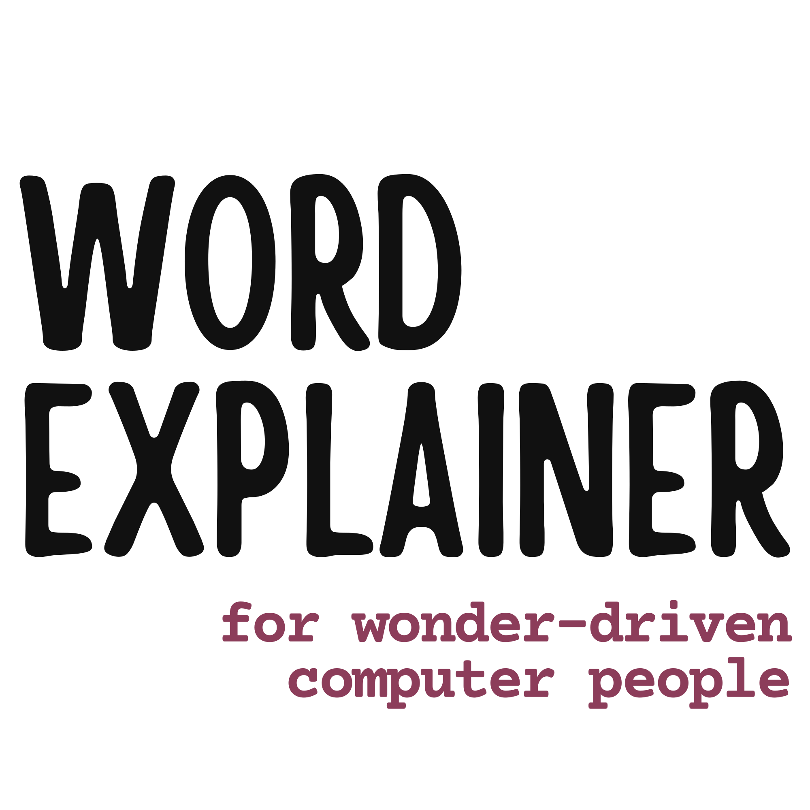

::: {.hero-section}

::: {.grid}

<!-- left padding column - hidden on mobile, visible on medium screens and up -->
::: {.g-col-0 .g-col-md-2}
:::

<!-- centre content - full width on mobile, 8/12 on medium screens and up -->
::: {.g-col-12 .g-col-md-8 .px-3 .px-md-0}

<!-- Split centre content into a grid -->
<!-- 1. Image of logo -->
<!-- 2. Text and H1 heading -->
::: {.grid .gap-3 .pb-3 .pt-4}

<!-- Center.1 column -->
::: {.g-col-12 .g-col-sm-6}
  
:::

<!-- Center.2 column -->
::: {.g-col-12 .g-col-sm-6 .mb-2}

# Helping

Explain what this is



[obligatory xkcd](https://xkcd.com/1133/)

<!-- close center.2 column -->
:::
<!-- Close grid within center content -->
:::

<!-- Close center content -->
:::
<!-- right padding column - hidden on mobile, visible on medium screens and up -->
::: {.g-col-0 .g-col-md-2}
:::

:::

<!-- hero-section -->
:::
